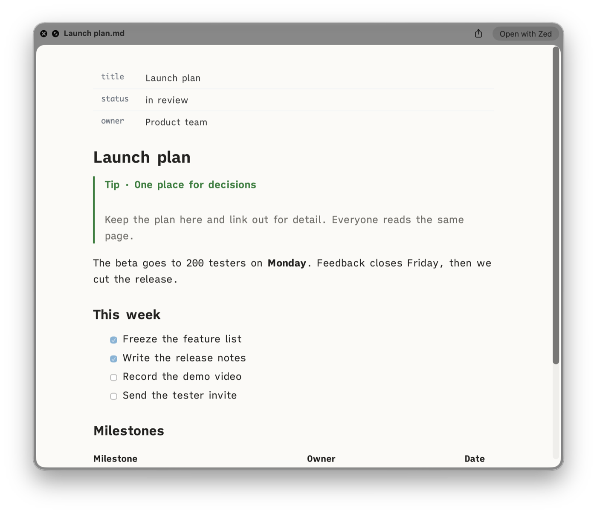
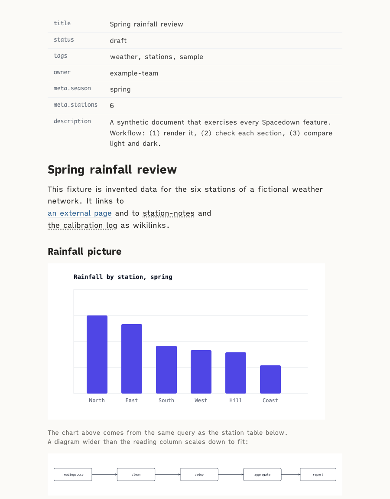
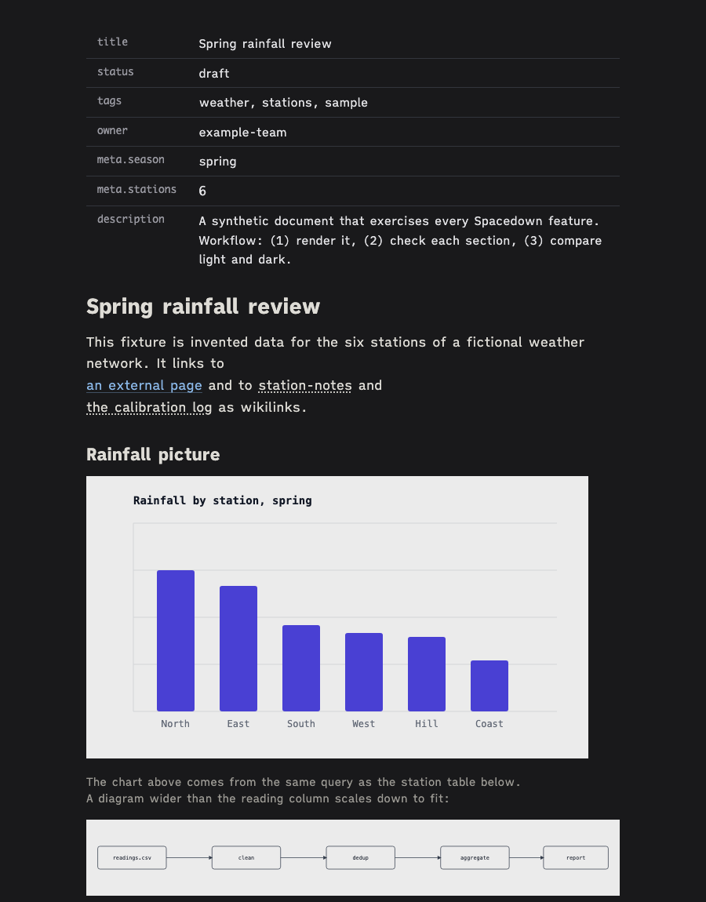
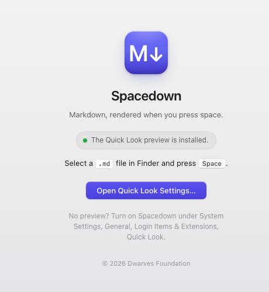

# Spacedown

[](https://github.com/dwarvesf/spacedown/releases/latest)
[](#download)
[](https://github.com/dwarvesf/homebrew-tools)
[](https://github.com/dwarvesf/spacedown/releases/latest)
[](LICENSE)

Press space on a Markdown file in Finder and read it rendered: headings, tables, code, callouts, frontmatter and LaTeX math, in a calm reading theme that follows light and dark mode.

Spacedown is a macOS Quick Look extension. It renders in-process with bundled copies of marked, KaTeX and highlight.js, so it needs no network, no pandoc and no setup beyond opening the app once.

| Part | What it does | Needs |
|---|---|---|
| `Spacedown.app` | Quick Look preview for `.md` files | macOS 13 or later |
| `spacedown` CLI | Companion renderer: Markdown to a self-contained HTML page via pandoc and KaTeX, opened in a browser | any Unix shell, `pandoc` |
| Safari drop extension (opt-in) | Drag a `.md` file onto a Safari tab to render it with the CLI | build from source, the CLI and `pandoc` |

## Download

Get the notarized `Spacedown-<version>.dmg` (or the `.zip`) from [Releases](https://github.com/dwarvesf/spacedown/releases/latest). Open it, drag Spacedown to Applications, open it once, then select a `.md` file in Finder and press space. With Homebrew: `brew install --cask dwarvesf/tools/spacedown`.

## Screenshots



| Light | Dark |
|---|---|
|  |  |



## Features

- **Math.** Inline `$...$` and display `$$...$$` math rendered by KaTeX.
- **Reading themes.** A warm `paper` theme by default, plus a serif `read` mode and a monospace `mono` mode.
- **Dark mode.** Every mode follows the system or browser appearance through `prefers-color-scheme`. There is no flag.
- **Outline sidebar.** A collapsible table of contents built from the headings, with scroll tracking. The `[` key toggles it.
- **Zoom and copy source.** `Cmd +`, `Cmd -` and `Cmd 0` scale the text. A toolbar button copies the original Markdown.
- **Frontmatter as a table.** A leading YAML block renders as a key and value table. Frontmatter that strict YAML parsers reject still renders.
- **Callouts.** Obsidian-style `> [!note] Title` blocks render as styled callouts.
- **Wikilinks.** `[[target]]` and `[[target|title]]` render as links.
- **Wide tables scroll.** Tables wider than the page scroll sideways instead of squashing.
- **Relative images work.** Images resolve against the source file's folder, wherever the HTML lands.
- **Folder mode.** `spacedown <dir>` renders every top-level Markdown file and writes an index page.
- **Live reload.** `--watch` re-renders on save and refreshes the open page.
- **Editor fonts.** Font settings from VS Code or VSCodium carry over to the page (see below).

## Install the spacedown CLI

The CLI is a single bash script plus the `assets/` folder next to it. It shares the `paper` theme with the Quick Look panel.

```bash
brew install pandoc        # required
brew install entr          # optional, only for --watch
# python3 is optional: it powers the frontmatter table, callouts and live reload.

git clone https://github.com/dwarvesf/spacedown.git
cd spacedown
mkdir -p ~/.local/bin
ln -sfn "$PWD/bin/spacedown" ~/.local/bin/spacedown
spacedown --version
```

The script resolves its own symlink, so `assets/` must stay next to `bin/`. Make sure `~/.local/bin` is on your `PATH`.

## Usage

```bash
spacedown notes.md                       # render and open in a browser
spacedown notes.md --no-open             # render only, print the output path
spacedown notes.md --out /tmp/page.html  # choose the output path
spacedown notes.md --watch               # re-render on save, page auto-refreshes
spacedown notes.md --font-mode read      # serif reading mode
spacedown .                              # every .md in this folder, plus an index
```

The default output path is `/tmp/spacedown/<slug>.html`, where the slug is the lowercased file name with every run of other characters turned into `-`. Rendering the same file again overwrites the same page, so a browser tab can stay open on it.

### Output contract

- **stdout** carries exactly one line on success: the absolute path of the HTML file. `open "$(spacedown notes.md --no-open)"` works.
- **stderr** carries everything else, each line prefixed with `spacedown:`.
- When stdout is not a terminal, `--no-open` is implied. Scripts and coding agents can call the tool without opening a browser.

### Flags

| Flag | Meaning |
|---|---|
| `<file>` or `<dir>` | A Markdown file, or a folder to render as an index (top level only). |
| `--out PATH` | Output HTML path. Parent folders are created. |
| `--no-open` | Do not open a browser. Implied when stdout is not a terminal. |
| `--watch` | Re-render on save (needs `entr`). With `python3`, the open page refreshes itself. Ctrl-C stops. |
| `--title STR` | Browser tab title. Default: the file name without its extension. |
| `--font-mode MODE` | `paper` (default), `read` or `mono`. See below. |
| `--no-standalone` | Emit an HTML fragment for embedding instead of a full page. |
| `--help`, `--version` | Print usage, or the version plus dependency status. |

### Font modes

| Mode | Look |
|---|---|
| `paper` (default) | Warm paper ground, a modest heading scale and soft rules. Set in iA Writer Quattro and iA Writer Mono when installed, otherwise in system fonts. Carries its own dark palette. |
| `read` | Proportional serif prose (Georgia first, for full Vietnamese diacritics) with monospace code and tables. |
| `mono` | Full editor fidelity: the fonts mirrored from the editor settings, monospace everywhere. |

The iA Writer fonts are free under the SIL Open Font License 1.1. Install them from [github.com/iaolo/iA-Fonts](https://github.com/iaolo/iA-Fonts) to get the intended typography. spacedown only names them in CSS and ships no font files.

`assets/paper-theme.css` is plain CSS, so it also works as a VS Code or VSCodium [`markdown.styles`](https://code.visualstudio.com/docs/languages/markdown#_using-your-own-css) entry. Point the setting at the file with a `file://` URL and an absolute path.

### Environment variables

| Variable | Effect |
|---|---|
| `SPACEDOWN_FONT_MODE` | Default font mode when `--font-mode` is absent. |
| `SPACEDOWN_SETTINGS` | A `settings.json` to read preview fonts from. Default: VSCodium's, then VS Code's. |
| `SPACEDOWN_BROWSER` | App name to open pages in, for example `"Google Chrome"`. Default: the first installed of Arc, Chrome, Edge and Brave, then the system default. |

spacedown reads `markdown.preview.fontFamily`, `markdown.preview.fontSize`, `markdown.preview.lineHeight` and `editor.fontFamily` from the settings file. With no settings file, stock VS Code defaults apply.

### Exit codes

| Code | Meaning |
|---|---|
| `0` | Success |
| `1` | Source file missing, unreadable or empty |
| `2` | pandoc missing or failed |
| `3` | `--watch` requested but `entr` is not installed |
| `64` | Usage error |
| `130` | Ctrl-C during `--watch` |

## Build the app from source

The Quick Look and Safari extensions live in one app bundle, `Spacedown.app`. One script builds, signs (ad hoc) and installs it.

Requirements: Xcode (for `xcodebuild` and `swiftc`) and [XcodeGen](https://github.com/yonaskolb/XcodeGen) (`brew install xcodegen`). `node` is optional: when present, the build first runs the Quick Look render tests.

```bash
integrations/build-safari.sh                # the app with the Quick Look extension only
integrations/build-safari.sh --with-safari  # also the Safari drop extension and its render helper
```

| Installed item | Path | When |
|---|---|---|
| `Spacedown.app` | `~/Applications/` | always |
| Render helper (XPC) | `~/.local/libexec/spacedown-render` | `--with-safari` |
| LaunchAgent `dfoundation.spacedown.render` | `~/Library/LaunchAgents/` | `--with-safari` |
| `spacedown-open` link | `~/.local/bin/spacedown-open` | `--with-safari` |

After the build, select a `.md` file in Finder and press space. If the preview does not appear, enable **Spacedown** under System Settings > General > Login Items & Extensions > Quick Look.

The Safari extension must be App-Sandboxed to load, and a sandboxed extension cannot run pandoc. It therefore forwards each dropped file over XPC to a small unsandboxed helper, which launchd starts on demand and which exits when idle. To enable the extension after `--with-safari`:

1. Safari > Settings > Developer: tick **Allow unsigned extensions**. An ad hoc signature counts as unsigned, and this setting resets on every Safari restart. A build signed and notarized with a Developer ID (`SIGN_ID` and `NOTARIZE`, see the header of `build-safari.sh`) skips this step; Safari does not list a Developer ID extension that is not notarized.
2. Quit and relaunch Safari.
3. Safari > Settings > Extensions: tick **Spacedown**.
4. Click the toolbar button, then drag a `.md` file onto the drop page.

`integrations/install.sh` sets up two more entry points: a Finder "Open With" app and a native-messaging host for a Chromium drop extension. See [integrations/README.md](integrations/README.md).

## Development

```bash
bash tests/smoke.sh                                   # CLI suite, also runs the Quick Look tests
node integrations/safari/quick-look/test-render.js    # Quick Look render core only
spacedown tests/fixture/fixture.md                   # synthetic document that exercises every feature
```

`assets/REFRESH.md` explains where the vendored VS Code stylesheet and highlight.js come from and how to refresh them.

### Releasing

The Releases page carries one release: each new version replaces the previous one.

1. Bump the version in `integrations/safari/quick-look/project.yml` (`MARKETING_VERSION`), the Xcode project (`MARKETING_VERSION`) and `bin/spacedown` (`VERSION`). Merge.
2. `scripts/release.sh` on a clean `main`: builds the Quick Look app, signs it with the Dwarves Foundation Developer ID, notarizes and staples it, builds the `.zip` and a notarized `.dmg`, and publishes the GitHub release. It then deletes the older releases and their tags. `KEEP_OLD_RELEASES=1` skips that step. It needs the Developer ID identity in the keychain and a `notarytool` keychain profile (default `DWARVES_NOTARY`); the script header lists every setting.
3. Bump `Casks/spacedown.rb` in [dwarvesf/homebrew-tools](https://github.com/dwarvesf/homebrew-tools) to the new version and the zip's sha256.
4. Mac App Store: `scripts/release.sh --mas` builds the signed store package; upload it to App Store Connect, attach the build to a new version and submit it for review.
5. App Store Connect listing and screenshots. These are separate one-off or per-release scripts, not called by `release.sh`.
   - `scripts/asc_setup.py`: one-time App Store Connect setup. Registers the app and Quick Look extension bundle ids, creates and imports the Apple Distribution and Mac Installer Distribution certificates, and saves the Mac App Store provisioning profiles. Needs the `dfoundation-prod` 1Password vault's "...Hacker Bar Release" item (Key ID, Issuer ID, private key) and `openssl`.
   - `scripts/asc_listing.py`: fills the App Store Connect listing through the API: categories, subtitle, description, keywords, age rating, price, territories, screenshots, and the processed build. Never submits for review. Needs the same 1Password item plus a metadata JSON file and screenshot PNGs as arguments.
   - `scripts/mas-altool.sh`: runs `altool` validate or upload for the signed `.pkg`, reading the API key from the same 1Password item at call time. Usage: `mas-altool.sh validate|upload <pkg>`.
   - `scripts/store-shots.sh`: renders the two App Store screenshots from the real Quick Look preview through headless Brave. Needs Brave Browser and Node. Renders the fixtures `scripts/launch.md` (light) and `scripts/showcase.md` (dark).
   - `scripts/readme-shots.sh`: renders the test fixture through the same Quick Look pipeline and screenshots it into `docs/images/` for this README. Needs Brave Browser and Node.
   - `scripts/window-shots.sh`: screenshots the app window page, Quick Look only and with Safari, light and dark, at the sizes `ViewController` sets. Needs Brave Browser.
   - `scripts/qlwrap.js`: wraps a Quick Look render body the way `MarkdownPreviewProvider.buildPreviewHTML` does. Used by `store-shots.sh` and `readme-shots.sh`. Needs Node.

## Limitations

- Pages open with `open(1)`, so browser launch is macOS only. On other systems, use `--no-open` and open the printed path yourself.
- In browser output, pandoc loads KaTeX from a CDN, so math in those pages needs a network connection. The Quick Look panel bundles KaTeX and works offline.
- The input is Markdown only.
- Release downloads are notarized. A build from source is signed ad hoc, so Gatekeeper and Safari treat it as unsigned.

## Credits

- The browser look builds on VS Code's markdown preview stylesheet (Microsoft, MIT).
- Math by [KaTeX](https://katex.org), Markdown parsing in Quick Look by [marked](https://marked.js.org), code highlighting in Quick Look by [highlight.js](https://highlightjs.org), conversion by [pandoc](https://pandoc.org).
- The `paper` theme names the iA Writer Quattro and iA Writer Mono typefaces. Fonts by Information Architects.

Licenses for bundled third-party code are in [THIRD_PARTY_NOTICES.md](THIRD_PARTY_NOTICES.md).

## License

MIT. See [LICENSE](LICENSE). Copyright (c) 2026 Dwarves Foundation.
