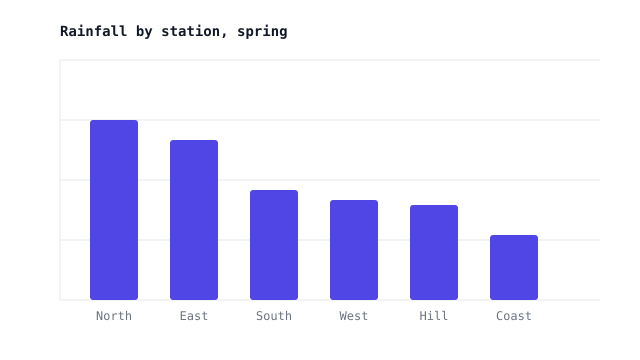
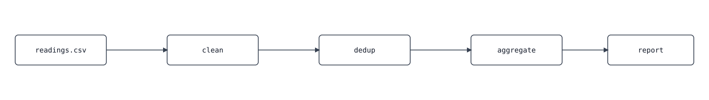

# Spring rainfall review

This fixture is invented data for the six stations of a fictional weather network. It links to
[an external page](https://example.com/network-guide) and to [[station-notes]] and
[[calibration-log|the calibration log]] as wikilinks.

## Rainfall picture



The chart above comes from the same query as the station table below.
A diagram wider than the reading column scales down to fit:



## Station table

| Station | Rain (mm) | Days | Max day (mm) | Mean (mm) | Share |
|---|---:|---:|---:|---:|---:|
| North | 412.6 | 38 | 41.2 | 10.9 | 24% |
| East | 366.0 | 35 | 37.5 | 10.5 | 21% |
| South | 251.3 | 29 | 30.1 | 8.7 | 15% |
| West | 230.8 | 27 | 28.4 | 8.5 | 13% |
| Hill | 219.4 | 31 | 22.0 | 7.1 | 13% |
| Coast | 150.2 | 22 | 19.6 | 6.8 | 9% |

Mean daily rainfall is $\bar{r} = \frac{R}{d}$ where $R$ is the season total and $d$ the number
of wet days. A station is dry for the season when $R < 0.5\,\bar{R}$.

### Derivation

Start from the share definition:
$$s_i = \frac{R_i}{\sum_{j=1}^{n} R_j}$$

[rearrange for the total]
$$\sum_{j=1}^{n} R_j = \frac{R_i}{s_i}$$

## Wide table

| Station | Mar W1 | Mar W2 | Mar W3 | Mar W4 | Apr W1 | Apr W2 | Apr W3 | Apr W4 | May W1 | May W2 | May W3 | May W4 | Notes on the sensor and the site |
|---|---:|---:|---:|---:|---:|---:|---:|---:|---:|---:|---:|---:|---|
| North | 31.2 | 28.0 | 40.1 | 35.5 | 36.0 | 33.9 | 29.7 | 38.2 | 30.0 | 36.6 | 34.1 | 39.3 | Tipping bucket replaced in week two; readings before that are scaled. |
| Coast | 11.0 | 9.6 | 14.2 | 12.8 | 13.1 | 12.0 | 10.9 | 14.4 | 11.5 | 13.7 | 12.2 | 14.8 | Salt spray on the funnel; cleaned every Monday. |

## Notes

- North ran high all season.
  - Split: 60% convective storms, 40% frontal rain.
  - Cross-checked against the Hill station on the same days.
- Coast stays the driest site, as in past seasons.
- **Action**: recalibrate the Hill gauge before the summer run.[^1]

Steps for the recalibration:

1. Log the current offset.
2. Pour the reference volume.
3. Record the new offset.

Checklist state:

- [x] Spring readings imported
- [ ] Hill gauge recalibrated
- [ ] Summer schedule published

> [!warning] Gauge drift
> Two stations drifted by more than 2 mm per week.
> Treat their late-season numbers as estimates.

> A plain blockquote stays a plain blockquote.

## Query used

```sql
SELECT station, SUM(rain_mm) AS rain, COUNT(*) FILTER (WHERE rain_mm > 0) AS wet_days
FROM readings
WHERE season = 'spring'
GROUP BY station
ORDER BY rain DESC;
```

```bash
spacedown tests/fixture/fixture.md --no-open
```

### Column dictionary

| Column | Meaning |
|---|---|
| `rain` | Season total in millimetres |
| `wet_days` | Days with any recorded rain |

---

[^1]: The recalibration uses the reference cup kept at each site.
